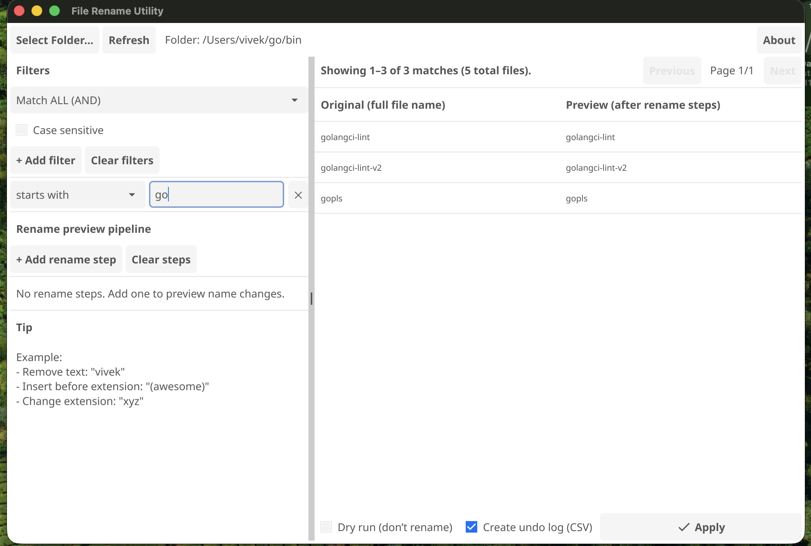
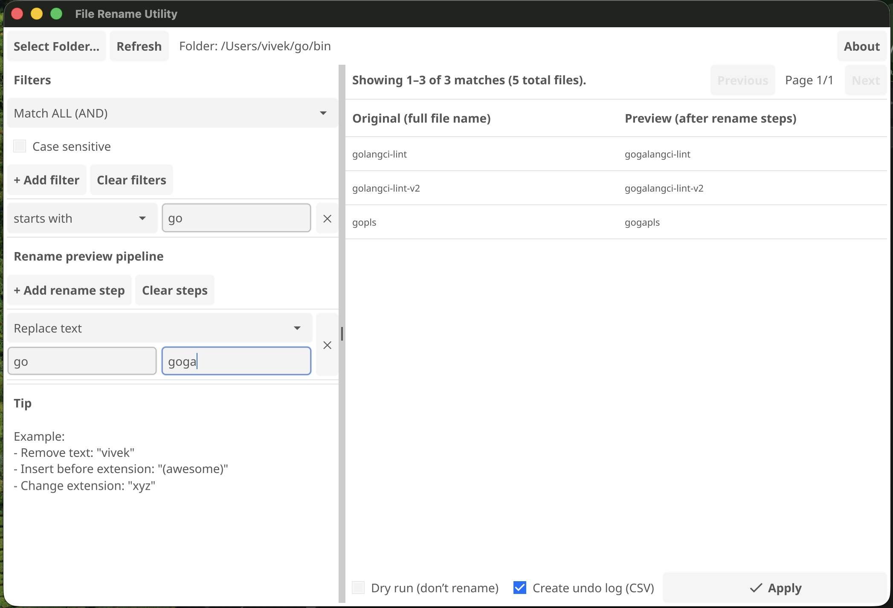

# RenForge (File Rename Utility)

A lightweight desktop utility (built with **Go + Fyne**) to **filter files** and **preview bulk renames** before applying them.

Website : https://renforgeapp.web.app
Repo: https://github.com/blackarck/renforge
Download : https://github.com/blackarck/RenForge/releases/tag/latest
---

## What it does (v1)

### ✅ Folder + preview

- Select a folder (non-recursive for now)
- Shows matching files with **full file names**
- Preview column shows the **new file name** after applying rename steps
- Preview text wraps and uses a smaller font so long names are readable

### ✅ Multiple filters (AND/OR)

Add multiple filter rules like:

- `starts with` → `The`
- `contains` → `Whale`
- `ends with` → `.mp3`
- `extension` → `png`

Options:

- **Match ALL (AND)** or **Match ANY (OR)**
- **Case sensitive** toggle

### ✅ Rename preview pipeline (multiple steps)

Add multiple rename steps and see the preview update live:

Supported rename steps:

- **Remove text**
- **Replace text**
- **Insert before extension**
- **Append**
- **Prepend**
- **Change extension**

Examples:

- Remove `vivek` from all file names
- Insert `(awesome)` before the extension
- Change extension to `xyz`

### ✅ Pagination

- Browse results with **Previous / Next** (page size = 10)

### ✅ Safety-first apply

Before renaming, FileRenUtil checks and warns about:

- **Invalid names** (empty, invalid characters, reserved names)
- **Duplicate preview conflicts** (two files would become the same name)
- **Target exists on disk** conflicts

These are **skipped** during Apply.

### ✅ Dry Run / Apply

- **Dry run** mode lets you generate a rename plan without touching files
- **Apply** performs the renames that are safe to execute

### ✅ Undo Log (CSV)

Optional **Undo Log (CSV)** export so you can revert changes later.
The log includes:

- `old_path`, `new_path`, `status`, `reason`, etc.

> Tip: Keep your undo CSV in the same folder as the renamed files for easy recovery.

---

## Screenshots




---

## Install / Download

- For the latest version, check the GitHub repo releases (if/when you add them):
  https://github.com/blackarck/renforge

---

## Build & Run

### Prerequisites

- Go (recommended: latest stable)
- Fyne dependencies (platform-specific)

Fyne setup docs (recommended): https://developer.fyne.io/started/

### Run locally

```bash
go run .
```

### Build Binary

```bash
go build -o filerenu .
```

## Roadmap ideas

- Recursive folder scan (include subfolders)
- Two-phase rename to support swaps/chains safely
- Regex filters and regex rename steps
- “Select subset” (checkbox per file)
- Export rename plan without Apply
- Export rename script

## License

RenForge is licensed under a dual-license model:

- **Non-commercial use**: Free under CC BY-NC 4.0
- **Commercial use**: Requires a paid commercial license

If you are an organization or plan to use RenForge commercially,
please contact us for licensing.
