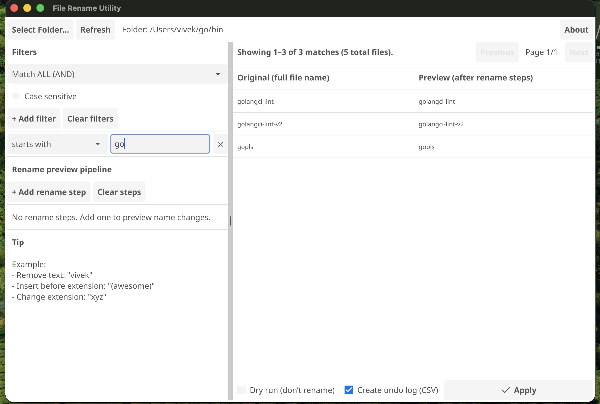
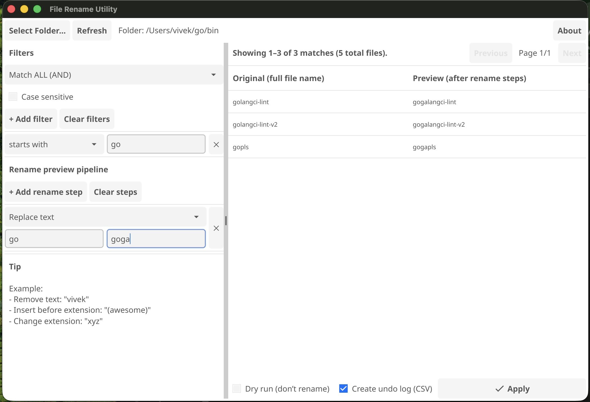

# RenForge (File Rename Utility)

A lightweight desktop utility (built with **Go + Fyne**) to **filter files** and **preview bulk renames** before applying them.

- Website : https://renforgeapp.web.app
- Repo: https://github.com/blackarck/renforge
- Download : https://github.com/blackarck/RenForge/releases/tag/latest
- [](https://youtu.be/x36PhFQ_yCY)

---

## Features

### Folder selection

- Select a folder with the **Select Folder…** button or pick from the **recent folders** dropdown (last 5 folders remembered across sessions)
- Toggle **Include subfolders** to scan recursively into subdirectories
- Hit **Refresh** to reload the current folder after external changes

### Multiple filters (AND/OR)

Add one or more filter rules to narrow down which files are shown:

| Mode | Example |
|---|---|
| `starts with` | `The` |
| `contains` | `Whale` |
| `ends with` | `.mp3` |
| `extension` | `png` |

- **Match ALL (AND)** or **Match ANY (OR)**
- **Case sensitive** toggle

### Rename preview pipeline

Add multiple rename steps — the preview updates live as you type:

| Step | Description |
|---|---|
| Remove text | Removes a substring from the filename |
| Replace text | Replaces one substring with another |
| Insert before extension | Inserts text just before the file extension |
| Append | Appends text before the extension |
| Prepend | Prepends text at the start of the filename |
| Change extension | Replaces the file extension |

Steps are applied in order, left to right.

### Per-file selection

- Every matched file has a **checkbox** in the preview — uncheck any file to exclude it from the rename
- **Select All** / **Deselect All** buttons for quick bulk toggling
- The header shows a live count: `Showing 1–10 of 42 matches · 38 selected · 100 total files`

### Pagination

Browse matched files with **Previous / Next** (10 files per page).

### Safety-first apply

Before renaming, RenForge validates every planned rename and warns about:

- **Invalid names** — empty names, invalid characters, Windows reserved names (CON, NUL, etc.)
- **Duplicate conflicts** — two selected files would become the same name
- **Target exists on disk** — the destination filename already exists

Problematic files are **skipped**; only safe renames proceed.

### Two-phase rename

Renames are executed in two phases — files move to a temporary name first, then to the final name. This makes swap-style renames (`a → b` and `b → a`) safe without either file clobbering the other.

### Dry Run / Apply

- **Dry run** (default) generates the rename plan and shows results without touching any files
- **Apply** executes the renames

### Undo Log (CSV)

Optional CSV export with one row per file:

`old_path`, `new_path`, `old_name`, `new_name`, `status`, `reason`

> Tip: Save the undo log in the same folder as the renamed files for easy recovery.

---

## Screenshots




---

## Install / Download

Download a pre-built binary for your platform from the latest release:
https://github.com/blackarck/RenForge/releases/tag/latest

---

## Build & Run

### Prerequisites

- Go (recommended: latest stable)
- Fyne platform dependencies

Fyne setup: https://developer.fyne.io/started/

### Run locally

```bash
go run .
```

### Build binary

```bash
go build -o renforge .
```

---

## Roadmap

- Regex filters and regex rename steps
- Step reordering via drag
- Save / load rename presets
- Export rename plan as shell script

---

## License

RenForge is licensed under a dual-license model:

- **Non-commercial use**: Free under [CC BY-NC 4.0](https://creativecommons.org/licenses/by-nc/4.0/)
- **Commercial use**: Requires a paid commercial license

For commercial licensing, contact: blackarck@gmail.com
